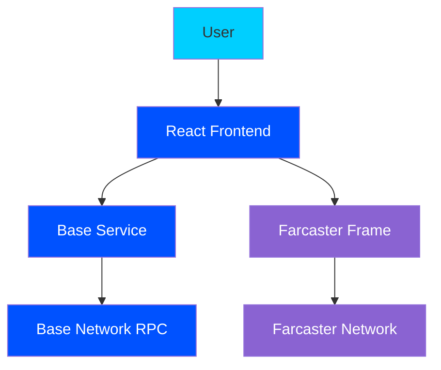

# Base First Transaction Tracker Architecture

## Components

1. **React Frontend**: User interface for entering Ethereum addresses and viewing results
2. **Base Service**: Handles communication with Base network RPC
3. **Base Network RPC**: Base mainnet node for fetching transaction data
4. **Farcaster Frame**: Metadata for sharing on Farcaster network

## Data Flow

1. User enters Ethereum address
2. Frontend validates address and sends to Base Service
3. Base Service queries Base Network RPC for transaction history
4. First transaction data is returned and formatted
5. Results are displayed to user with celebration effects
6. User can share results as a Farcaster Frame